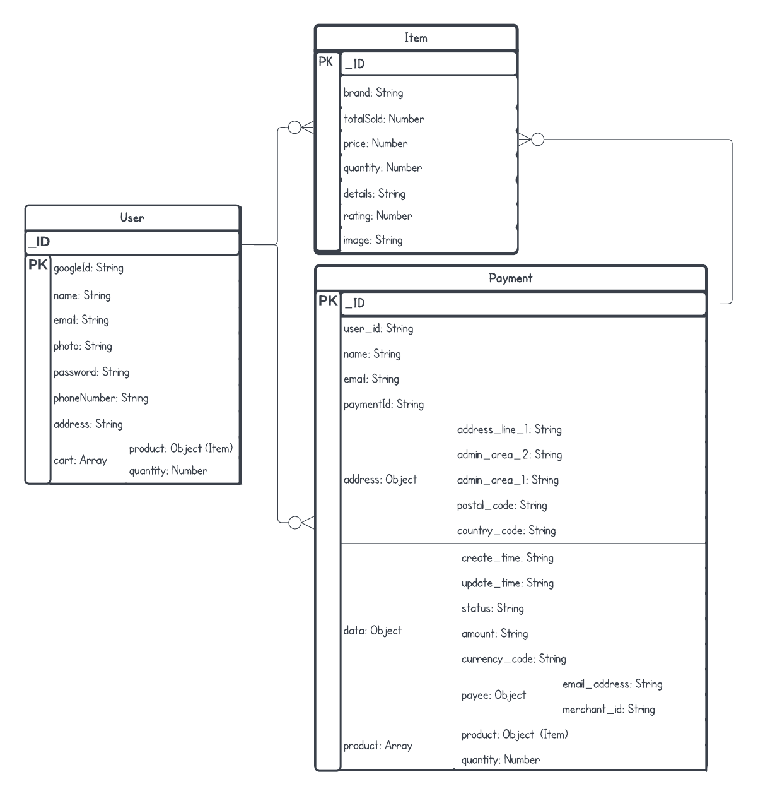

# Sneakers

Sneaker is a page that user can search, get information about various sneakers. You can select, buy and make a payment for this shoes

## User Story

As a user, you can get and select items

As a admin page, you can edit, upload, get , delete your items

### Authentication

-[] as a user, i can register and login with name, email, password
-[] as a admin shop, i can register and login with name, email, password

### Users

-[] as a user, i can see list of items
-[] as a user, i can update my profile

### Admin

-[] as a admin shop, i can edit item
-[] as a admin shop, i can create new item
-[] as a admin shop, i can delete the item

### Items

-[] as a user and admin, i can get list of items
-[] as a user and admin, i can get detail of item

## Endpoint APIs

### Auth APIs

```Javascript
/**
 * @route POST /users/login
 * @description Log in with username and password
 * @body {email, password}
 * @access Public
 * /
```

```Javascript
/**
 * @route POST /admins/login
 * @description Log in with username and password
 * @body {email, password}
 * @access Public
 * /
```

### Users APIs

```Javascript
/**
 * @route POST /users
 * @description Register new user
 * @body {name, email, password}
 * @access Public
 * /
```

```Javascript
/**
 * @route PUT /users
 * @description Update user's profile
 * @body {name, phoneNumber, address}
 * @access Login required
 * /
```

```Javascript
// Route for user make a payment
```

### Admin APIs

```Javascript
/**
 * @route POST /admins
 * @description Register new admin
 * @body {name, email, password}
 * @access Public
 * /
```

```Javascript
/**
 * @route PUT /admins/items/:id
 * @description Update the item
 * @body {quantity, images, details, brand, price}
 * @access Login required
 * /
```

```Javascript
/**
 * @route POST /admins/items
 * @description Create new item
 * @body {name, quantity, images, description}
 * @access Login required
 * /
```

```Javascript
/**
 * @route DELETE /admins/items/:id
 * @description Delete the item
 * @access Login required
 * /
```

### Items

```Javascript
/**
* @route GET /items?page=1&limit=20
* @description Get item with pagination
* @access Public
* /
```

```Javascript
/**
* @route GET /items/:id
* @description Get the item's detail
* @access Public
* /
```

## Diagram Relation
